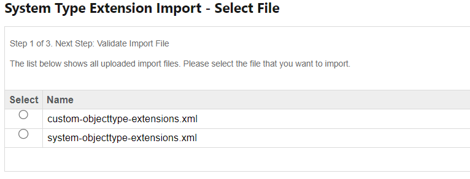
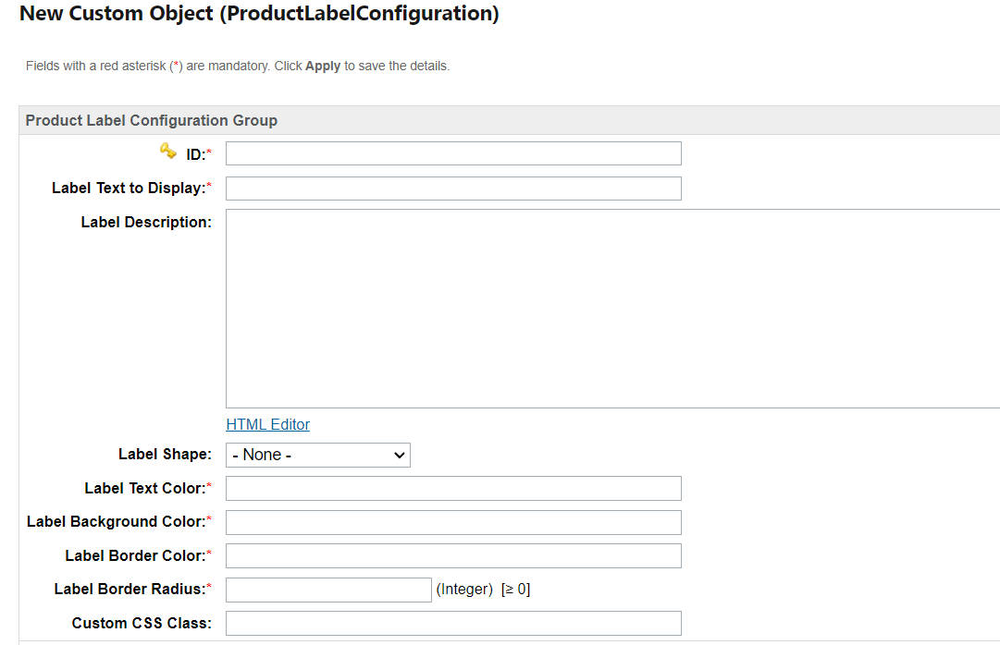
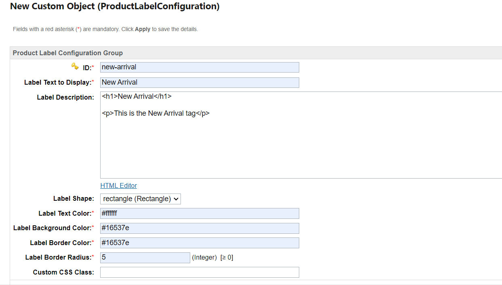
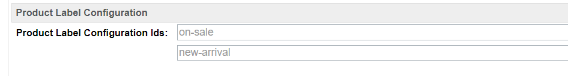
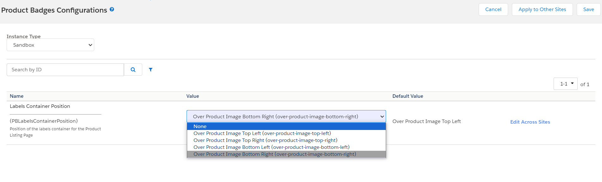
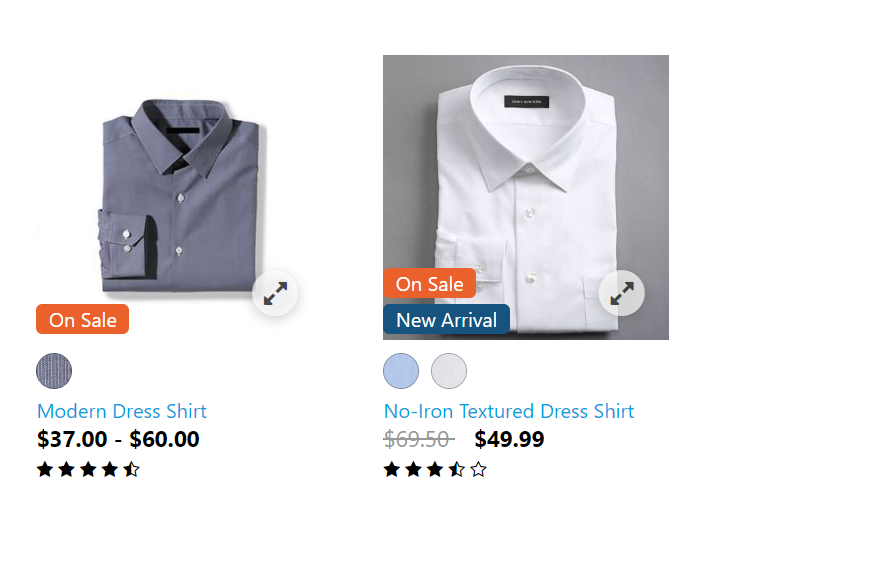
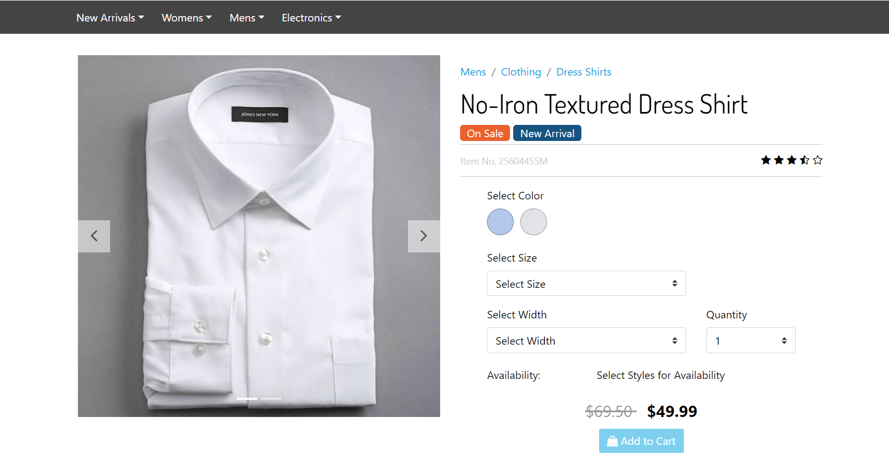
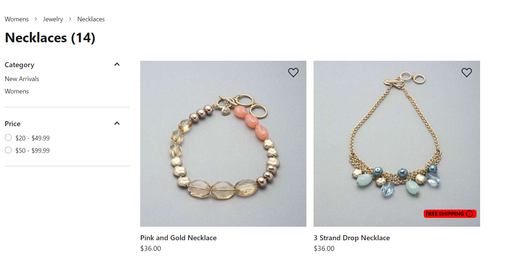
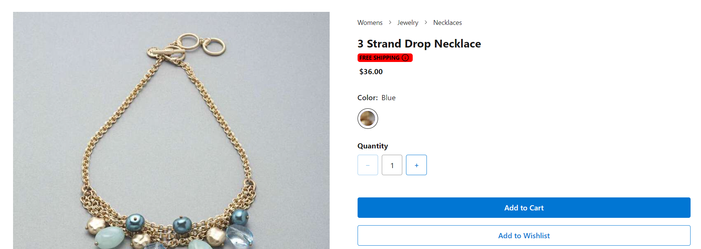
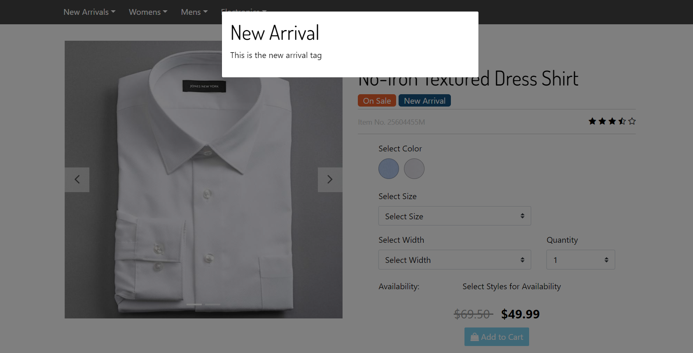

# Salesforce Commerce Cloud (SFCC) Product Badges for SFRA

Product Badges for Salesforce Commerce Cloud (SFCC) is a comprehensive package that adds essential functionalities for e-commerce. This plugin allows you to establish, manage and assign labels to products, which is particularly useful for businesses that want to add relevant and very specific information to the offered products.

Moreover, this package can seamlessly integrate with Salesforce Commerce Cloud architectures like Storefront Reference Architecture (SFRA) or PWA Kit | Composable Storefront. This flexibility ensures a customizable implementation, adapting to the specific needs of each e-commerce business.

# Features 

SFCC Product Badges provides the following features:

- Create configurations for labels
- Assign labels to specific products
- Customization of the product labels

# Prerequisites

1. The store must be previously configured and functioning correctly under the SFRA or PWA kit Architecture.

2. You must have **Administrator** permissions in the Business Manager (BM), which will allow you to configure the package.

# Installation

### Storefront Reference Architecture (SFRA)

The Product Badges for Salesforce Commerce Cloud (SFCC) is designed to integrate with Storefront Reference Architecture (SFRA). To install this package, please follow the instructions in the [installation guide for SFRA](./sfra-cartridges/product_badges/README.md)

### PWA kit

The Product Badges for Salesforce Commerce Cloud (SFCC) is designed to integrate with PWA Kit. To install this package, please follow the instructions in the [installation guide for PWA Kit](./sfcc-product-badges/README.md)

# Set up & Usage

### Set up

Go to the Business Manager (BM) with administrator permissions and proceed to perform the following steps to correctly configure the required package fields:

1. Go to the **Administration** option > **Site Development** column > **Import & Export**
2. Locate the **Import & Export files** section and click the **Upload** option
3. While in the new section choose and upload the provided XMLs files: [system object types](./sfra-cartridges/product_badges/metadata/product_badges_metadata/meta/system-objecttype-extensions.xml) file amd [custom object types](./sfra-cartridges/product_badges/metadata/product_badges_metadata/meta/custom-objecttype-extensions.xml)
4. After uploading the files, you should be able to see it in the table under the **Manage Import Files** section
5. Return to **Import & Export** column and locate the **Meta Data** section and click on the **Import** option
6. You should see the file uploaded previously in a table under the **System Type Extension Import - Select File** section, select it and then, click the **Next** button

> [!NOTE]
> In case you found any error logs during the import process, we recommend contacting the Appspring Technologies team for assistance and to resolve any.

7. After clicking the **Next** button, proceed by clicking **Import**
8. You can review the import status and/or verify that the fields have been created correctly
9. If the import was successful, you should be able to see the following fields created for the **ProductLabelConfiguration** system object:

    - **ID** field specifications:
        - ID: **priceBookId**
        - Display Name: ID
        - Value Type: String
        - Mandatory: True
    
    - **Label Text to Display** field specifications:
        - ID: **PB_label_text_to_display**
        - Display Name: Label Text to Display
        - Value Type: String
        - Mandatory: True

    - **Label Description** field specifications:
        - ID: **PB_label_description**
        - Display Name: Label Description
        - Value Type: HTML
        - Mandatory: False

    - **Label Text Color** field specifications:
        - ID: **PB_label_text_color**
        - Display Name: Label Text Color
        - Value Type: String
        - Mandatory: True

    - **Label Shape** field specifications:
        - ID: **PB_label_shape**
        - Display Name: Label Shape
        - Value Type: Enum of Strings
        - Mandatory: False

    - **Label Border Radius** field specifications:
        - ID: **PB_label_border_radius**
        - Display Name: Label Border Radius
        - Value Type: String
        - Mandatory: True

    - **Label Background Color** field specifications:
        - ID: **PB_label_background_color**
        - Display Name: Label Background Color
        - Value Type: String
        - Mandatory: True

    - **Label Border Color** field specifications:
        - ID: **PB_label_border_color**
        - Display Name: Label Border Color
        - Value Type: String
        - Mandatory: True

    - **Custom CSS Class** field specifications:
        - ID: **PB_CSSClass**
        - Display Name: Custom CSS Class
        - Value Type: String
        - Mandatory: True

    - **Product Label Configuration Group** group specifications:
        - ID: **ProductLabelConfigurationGroup**

10. If the import was successful, you should be able to see the following fields created for the **Product** system object:

    - **Product Label Configuration Ids** field specifications:
        - ID: **PB_ProductLabelConfigurationIds**
        - Display Name: Product Label Configuration Ids
        - Value Type: Set of String
        - Mandatory: False

    - **Product Label Configuration** group specifications:
        - ID: **ProductLabelConfiguration**

11. If the import was successful, you should be able to see the following fields created for the **SitePreferences** system object:

    - **Labels Container Position** field specifications:
        - ID: **PBLabelsContainerPosition**
        - Display Name: Labels Container Position
        - Value Type: Enum of String
        - Mandatory: False

    - **Product Badges Configurations** group specifications:
        - ID: **ProductBadgesGroup**

### Usage

After correctly creating and grouping the new fields, you can procede to properly to configure data in order to use the package.

SFCC Product Badges allows the site administrator to create new configurations that represent each label that can be added to the products. In order to create a new product label configuration, the site administrator needs to go to *Merchant Tools > Custom Objects > Custom Object Editor*. In this section you should be able to choose the Object Type **ProductLabelConfiguration** in the select (if you followed the [Setup](#set-up) steps correctly) and once is selected, you can click on the *New* button and it will take you to a form for the Product Label Configuration.

SFCC Product Badges offers different creation and customization options for the creation of the product label: 
    
- The **ID** which is the unique identifier of the label and it will very important when assigning a label to a product
- The field **Label Text to Display** in which you will place the information/text to be displayed on the label
- The **Label Description** which is meant to provide some information about the label. The value for this field is an HTML snippet, so you can enter the HTML directly or you can use the HTML Editor provided by the Business Manager
- The **Label Shape** field which will determine the shape of the created label. For this version the only supported shape is *rectangle*,  however support for more labels will be added in upcoming versions
- The **Label Text Color** field which determines the color of the text displayed on the label. This field only supports the hexadecimal color code, so make sure to keep this in mind when adding a value for this field
- The **Label Background Color** field which determines the background color of the label. This field only supports the hexadecimal color code, so make sure to keep this in mind when adding a value for this field
- The **Label Border Color** field which determines the border color of the label. This field only supports the hexadecimal color code, so make sure to keep this in mind when adding a value for this field
- The **Label Border Radius** field which determines the border radius of the label. Keep in mind that the number entered in this field represents a value in pixels
- The **Custom CSS Class** field, in which you can put the name of a custom CSS class in order to add more customization to the created label

All this labels are mandatory except for **Label Description** and **Custom CSS Class**, so make sure to fill properly the mandatory ones in order to create the product label successfully.

After saving the new product label configuration, you should be able to see you new label in *Merchant Tools > Custom Objects > Custom Object Editor* by selecting the **Product Label Configuration** object in the select field and clicking the *Find* button. You can create as many label configurations as you need and you can edit those configurations whenever you need.

After creating the label configurations, you can proceed to assign those configurations to the products. In order to do this, you must go to *Merchant Tools > Products and Catalogs > Products* and in there, search for the product to which you need to assign the label. In the *General* tab of the product information, you should see a new section called **Product Label Configuration** that allows you to assign as many labels as needed to the product. In the field you need to type the **ID** of the product label and it must be the exact same value when you created the label configuration, if you place an ID that does not correspond to any of the created label configurations, no label is going to be displayed on the storefront.

The plugin also provides the option to configure the position of the labels container over the product tile image in the Product Listing Page. You can find this option in *Merchant Tools > Site Preferences > Custom Preferences* and in there, click on the **ProductBadgesGroup**. In this section you will find a select that contains the following options: Over Product Image Top Left, Over Product Image Top Right, Over Product Image Bottom Left and Over Product Image Bottom Right. You will only need to select one of those options and then apply the changes in order to set the position of the labels container. The option *Over Product Image Top Left* is selected by default unless you change it

> [!NOTE]
> It is important to keep in mind that this option only affects the position of the labels container in the Product Listing Page

Now that the labels have been created, customized and assigned correctly, you should be able to see them over the product tile image in the Product Listing Page and under the name of the product in the Product Detail Page.

Additionally, in the Product Detail Page, you should be able to see a modal when you click on a product label that has description configured. The modal will display the value entered in the **Label Description** field of the corresponding label.

